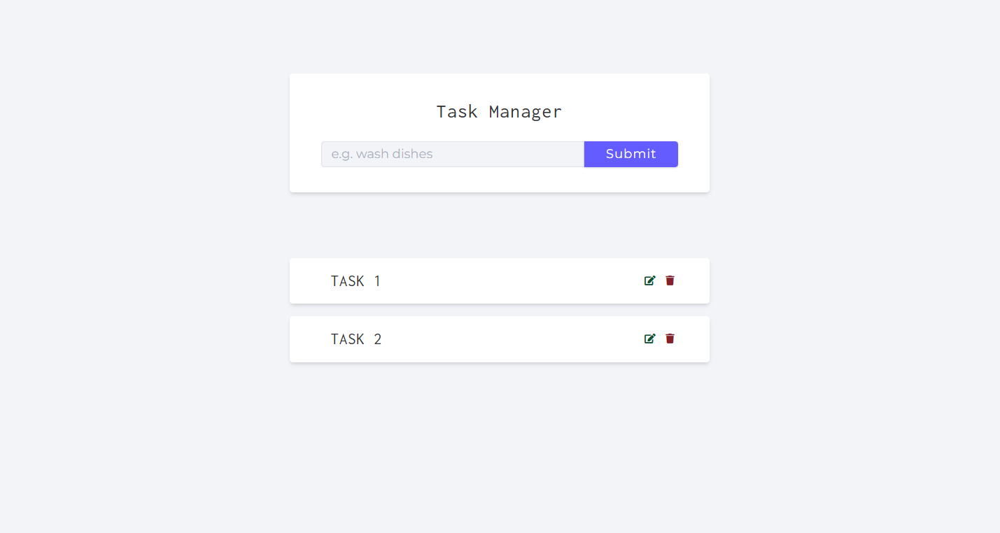

# Task Manager API

This is a simple Task Manager API built with **Node.js**, **Express**, and **MongoDB**. The API allows users to create, update, delete, and retrieve tasks. It includes basic error handling and asynchronous middleware for managing database operations.

## 🚀 Features

- **GET `/api/v1/tasks`**: Get all tasks.
- **GET `/api/v1/tasks/:id`**: Get a specific task by ID.
- **POST `/api/v1/tasks`**: Create a new task.
- **PUT `/api/v1/tasks/:id`**: Update an existing task.
- **DELETE `/api/v1/tasks/:id`**: Delete a specific task.

## 📦 Requirements
- Express.js
- Mongoose (for MongoDB)
- dotenv (for environment variable management)

## 🖼️ Website Preview

